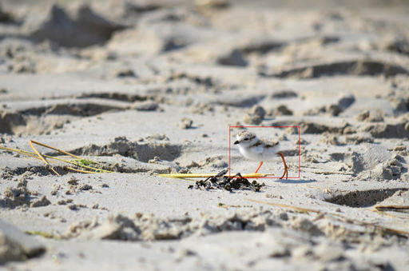
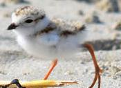
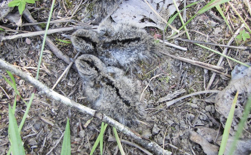
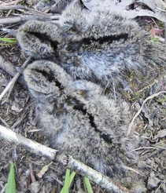
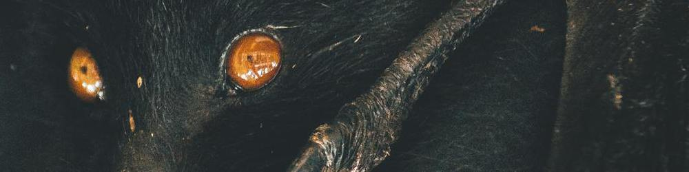

## Building a Twitter Image Bot with Flickr and Google Cloud Platform

---

### What do you want to see more often?

---

"What if I made a bot that exclusively posted pictures of plovers and their babies?"

---

### Working with Intellectual Property

---

Crediting photographers and not reposting copyrighted images were priorities for me.

---

### How will you find images?

* [Bing Image Search API](https://azure.microsoft.com/en-us/services/cognitive-services/bing-image-search-api/) &ndash; filter by [license](http://help.bing.microsoft.com/#apex/18/en-us/10006/0)
* [Google Custom Search API](https://developers.google.com/custom-search/) &ndash; filter by [rights](https://developers.google.com/custom-search/json-api/v1/reference/cse/list#parameters)
* [Flickr API](https://www.flickr.com/services/api/) &ndash; filter by [license](https://www.flickr.com/services/api/flickr.photos.search.html)
* [Unsplash API](https://unsplash.com/developers) &ndash; all images are licensed [similar](https://medium.com/unsplash/the-unsplash-license-f6fb7de5c95a) to CC-0

---

### Searching Flickr

```
resp = flickr.photos.search({"text": "plover baby"})
```

---

### That's not a bird...


---

Flickr returns photos that contain the search term in their title, description, or tags.

---

> ...threatened and endangered species that occur in Connecticut, including the threatened bog turtle, piping `plover`, and Puritan tiger beetle...

---

I can sort Flickr results by relevance, but how do I know when results stop being relevant?

---

### Cloud Vision API

> ...easily integrate vision detection features within applications, including image labeling, face and landmark detection, optical character recognition (OCR), and tagging of explicit content.

---

### Features

* Face Detection
* Landmark Detection
* Logo Detection
* Text Detection
* Document Text Detection
* Safe Search Detection
* Image Properties
* Crop Hints
* Web Detection
* Label Detection
* Object Localization

---

### Client Libraries

* C#
* Go
* Java
* Node.js
* PHP
* Python 🐍
* Ruby

---

### Label Detection

> detects broad sets of categories within an image

---

### Definitely not a bird
```
fauna 0.86
turtle 0.85
emydidae 0.81
terrestrial animal 0.81
reptile 0.78
insect 0.76
organism 0.74
beetle 0.60
tortoise 0.59
box turtle 0.53
```

---

### But this _is_ a bird



```
sand 0.78
```

---

### Object Localization

> detects and extracts multiple objects in an image

---

### Well, it's definitely something...

```
name: "Animal"
score: 0.6270866990089417
bounding_poly {
  normalized_vertices {
    x: 0.4472714960575104
    y: 0.6022735238075256
  }
  normalized_vertices {
    x: 0.6556387543678284
    y: 0.6022735238075256
  }
  normalized_vertices {
    x: 0.6556387543678284
    y: 0.7196335792541504
  }
  normalized_vertices {
    x: 0.4472714960575104
    y: 0.7196335792541504
  }
}
```

---

### Crop to object and detect labels again



```
bird 0.96
beak 0.93
fauna 0.91
wren 0.74
shorebird 0.65
sparrow 0.64
charadriiformes 0.59
seabird 0.56
wildlife 0.54
```

---

### Detecting and labeling objects is not bulletproof.

---

### Doesn't look like anything to me



```
fauna 0.85
grass 0.79
soil 0.65
```

---

### After cropping



```
plant 0.74
grass 0.84
tree 0.53
```

---

### Cloud AutoML Vision

> train custom machine learning models

---

I have not trained a model to distinguish camouflaged fauna from flora

...yet.

---

### Cloud Datastore
###### (technically Cloud Firestore in Datastore mode)

---

Cloud Datastore is a NoSQL database.

Now that it's built on top of Firestore, it's strongly consistent.

But because Firestore is in Datastore mode, real-time updates are not supported.

---

### Data Model

> Data objects are known as entities. An entity has one or more named properties, each of which can have one or more values. Entities of the same kind do not need to have the same properties, and an entity's values for a given property do not all need to be of the same data type.

---

### Composite Indexes

(And helpful error messages!)

```
google.api_core.exceptions.FailedPrecondition: 400 no matching
index found. recommended index is:
- kind: Photo
  properties:
  - name: is_bird
  - name: last_tweeted
```

---

## Birds, But Make It Spooky



---

### [@beachbirbys](https://www.twitter.com/beachbirbys)

---

### Further GCP Integration

* Cloud Storage
* App Engine 
* Cloud Functions

---

### Alternatives

#### [PythonAnywhere](https://www.pythonanywhere.com/)

---

### Twitter Changes

> All new developers must apply for a developer account to access Twitter APIs.

---

### Mastodon

* [API documentation](https://github.com/tootsuite/documentation/blob/master/Using-the-API/API.md)
* [Client Libraries](https://github.com/tootsuite/documentation/blob/master/Using-the-API/Libraries.md)
* [BotsIn.Space](https://botsin.space/) &ndash; an instance just for bots!

---

### Photo Credits
* [Threatened baby bog turtle (Clemmys muhlenbergii)](https://www.flickr.com/photos/usfwsendsp/5039503186) by Rosie Walunas/USFWS (CC BY 2.0)
* [Piping Plover Chicks](https://www.flickr.com/photos/joeshlabotnik/29025989546/) by Joe Shlabotnik (CC BY-NC-SA 2.0)
* [Spotted Sandpiper Hatchlings](https://www.flickr.com/photos/guylmonty/15811119800) by Guy Monty (CC BY-NC-SA 2.0)
* [Hunger](https://unsplash.com/photos/dqdN89NNPwk) by Rob Potter (Unsplash License)

---

### Rachel Ramsay

Developer Avocado, Clover Network

_cares about birds the normal amount_

[@rachelbuilds](https://www.twitter.com/rachelbuilds)

Find today's slides and code at [github.com/rayramsay/birbybot/](https://github.com/rayramsay/birbybot/)