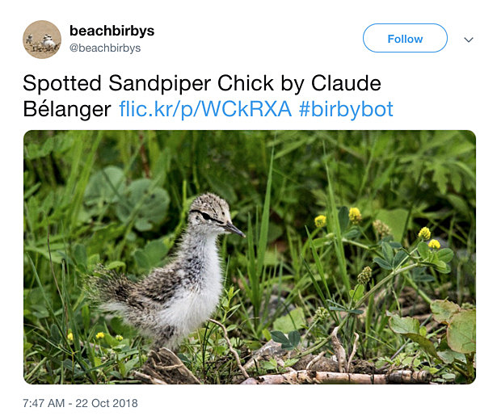

## Building a Twitter Bot with Flickr and GCP

---

### A Simple Question

"What if I made a bot that exclusively posted pictures of plovers and their babies?"

---



---

### A Simple Plan

1. Get pictures of plover babies from Flickr.
2. Post those pictures to Twitter.
3. Feel dopamine flood my brain.

---

### Problem #1

Crediting photographers and not reposting copyrighted images were priorities for me.

---

### Solution #1


---

### Searching Flickr

```
resp = flickr.photos.search({"text": "plover baby"})
```

---

### That's not a bird...


---

Flickr returns photos that contain the search term in their title, description, or tags.

---

> ...threatened and endangered species that occur in Connecticut, including the threatened bog turtle, piping `plover`, and Puritan tiger beetle...

---

### Problem #2

How do I make sure that my bot only tweets bird photos?

---

### Cloud Vision API

> ...easily integrate vision detection features within applications, including image labeling, face and landmark detection, optical character recognition (OCR), and tagging of explicit content.

---

#### Approach #1
### Label Detection

> detects broad sets of categories within an image

---

### Definitely not a bird
```
fauna 0.86
turtle 0.85
emydidae 0.81
terrestrial animal 0.81
reptile 0.78
insect 0.76
organism 0.74
beetle 0.60
tortoise 0.59
box turtle 0.53
```

---

### But this is a bird


```
sand 0.78
```

---

#### Approach #2
### Object Localization

> detects and extracts multiple objects in an image

---

### Well, it's definitely something...

```
name: "Animal"
score: 0.6270866990089417
bounding_poly {
  normalized_vertices {
    x: 0.4472714960575104
    y: 0.6022735238075256
  }
  normalized_vertices {
    x: 0.6556387543678284
    y: 0.6022735238075256
  }
  normalized_vertices {
    x: 0.6556387543678284
    y: 0.7196335792541504
  }
  normalized_vertices {
    x: 0.4472714960575104
    y: 0.7196335792541504
  }
}
```

---

#### Solution #2
### Crop Object and Label


```
bird 0.96
beak 0.93
fauna 0.91
wren 0.74
shorebird 0.65
sparrow 0.64
charadriiformes 0.59
seabird 0.56
wildlife 0.54
```

---

#### Problem #3
### Detecting and labeling objects is not bulletproof.

---

### Doesn't look like anything to me


```
fauna 0.85
grass 0.79
soil 0.65
```

---

### After cropping


```
plant 0.74
grass 0.84
tree 0.53
```

---

### Cloud AutoML Vision

> train custom machine learning models

---

### Solution #3?

I have not trained a model to distinguish camouflaged fauna from flora

...yet.

---

## Demo

### Birds, But Make It Spooky


---

### [@beachbirbys](https://www.twitter.com/beachbirbys)

---

### Additional GCP ML APIs

* Cloud Video Intelligence API
* Cloud Speech-to-Text
* Cloud Natural Language API
* Cloud Translation API

---

### Further GCP Services

* Cloud Storage
* App Engine 
* Cloud Functions

---

### Alternatives 🐙

#### [PythonAnywhere](https://www.pythonanywhere.com/)

---

### Twitter Changes

> All new developers must apply for a developer account to access Twitter APIs.

---

### Mastodon

* [API documentation](https://github.com/tootsuite/documentation/blob/master/Using-the-API/API.md)
* [Client Libraries](https://github.com/tootsuite/documentation/blob/master/Using-the-API/Libraries.md)
* [BotsIn.Space](https://botsin.space/) &ndash; an instance just for bots!

---

### What do you want to see?

---

### Photo Credits
* [Threatened baby bog turtle (Clemmys muhlenbergii)](https://www.flickr.com/photos/usfwsendsp/5039503186) by Rosie Walunas/USFWS (CC BY 2.0)
* [Piping Plover Chicks](https://www.flickr.com/photos/joeshlabotnik/29025989546/) by Joe Shlabotnik (CC BY-NC-SA 2.0)
* [Spotted Sandpiper Hatchlings](https://www.flickr.com/photos/guylmonty/15811119800) by Guy Monty (CC BY-NC-SA 2.0)
* [Hunger](https://unsplash.com/photos/dqdN89NNPwk) by Rob Potter (Unsplash License)

---

### Rachel Ramsay

Developer Avocado, Clover Network

_cares about birds the normal amount_

[@rachelbuilds](https://www.twitter.com/rachelbuilds)

Find today's slides and code at [github.com/rayramsay/birbybot/](https://github.com/rayramsay/birbybot/)